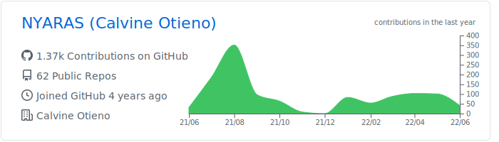

### Hi there, I'm Calvine 👋

## I'm a Developer, and DevOps Engineer!!

- 🌱 I’m currently learning everything 🤣
- 👯 I’m looking to collaborate with other developers
- 🥅 2021 Goals: Contribute more to Open Source projects and get 2 Cloud Certifications
- ⚡ Fun fact: I love listening to rhumba

### Languages & Tools 🛠

&nbsp;
&nbsp;
&nbsp;
&nbsp;
&nbsp;
&nbsp;

&nbsp;
&nbsp;
&nbsp;
&nbsp;

&nbsp;
&nbsp;
&nbsp;
&nbsp;
&nbsp;
&nbsp;

&nbsp;
&nbsp;
&nbsp;
&nbsp;

### Analytics ⚙️
  

  
  

  
  

### Let's connect ? 🤝

 

 

 
