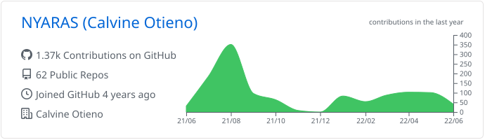

# Software Developer & DevOps Engineer

- 🌱 I’m currently learning everything 🤣
- 👯 I’m looking to collaborate with other developers, especially for open-source work
- 🥅 2024 Goals: Contribute more to Open Source projects and get at least 3 Cloud Certifications
- ⚡ Fun fact: I love listening to Rhumba and hiking/travelling 

### Follow me here 🤝

I post frequently on [medium](https://medium.com/@calvineotieno010), and on [linkedin](https://www.linkedin.com/in/calvine-otieno-0259a813b).

### Languages & Tools 🛠

&nbsp;
&nbsp;
&nbsp;
&nbsp;
&nbsp;
&nbsp;

&nbsp;
&nbsp;
&nbsp;
&nbsp;

&nbsp;
&nbsp;
&nbsp;
&nbsp;
&nbsp;
&nbsp;
&nbsp;

&nbsp;
&nbsp;
&nbsp;
&nbsp;
&nbsp;
&nbsp;

### Analytics ⚙️
  

  
  

  
  

##  **My Certifications 🏅**
- [AWS Certified: Security Specialty](https://www.credly.com/badges/efa2379a-4007-40f9-9cef-00d98575d415)
- [AWS Certified: Advanced Networking Specialty](https://www.credly.com/badges/83200658-432d-41bc-a603-e02cb5d6fd85)
- [AWS Certified: Big Data Specialty](https://www.credly.com/badges/1fc70ac2-66a9-4f3e-a7c4-e8640be65b14)
- [AWS Certified: Solutions Architect Professional](https://www.credly.com/badges/829b2cc2-8bf5-45e8-8820-41804d0af88b)
- [AWS Certified: DevOps Engineer Professional](https://www.credly.com/badges/ac6f908e-731c-4b79-a624-a6f44b3d847f)
- [HashiCorp Certified: Vault Operations Professional](https://www.credly.com/badges/38df2ba2-894d-44ed-ab89-d047ae8f15d0)
- [HashiCorp Certified: Terraform Associate](https://www.credly.com/badges/829b2cc2-8bf5-45e8-8820-41804d0af88b)
- [HashiCorp Certified: Vault Associate](https://www.credly.com/badges/04658c9a-e756-40f5-9cc1-0038c3355c54)
- [HashiCorp Certified: Consul Associate](https://www.credly.com/badges/10bb093f-0018-40c3-bcb5-8ba4605457fb)

- See all my Certifications here 👉🏻 [Credly](https://www.credly.com/users/otieno-calvine)

  
  
  
  
  

##  **My Achievements 🏅**
- [KCNA: Kubernetes and Cloud Native Associate](https://www.credly.com/badges/2f1ea2ee-79d0-4988-8a1f-f23b16347664)
- [CKAD: Certified Kubernetes Application Developer](https://www.credly.com/badges/47d8b812-bd32-494c-8412-05d4c211df71)
- [CKA: Certified Kubernetes Administrator](https://www.credly.com/badges/b0926251-6c28-40d2-bac7-2c09af165b2b)
- [HashiCorp Certified: Terraform Associate (003)](https://www.credly.com/badges/fe655d12-5f91-4fb5-8f99-98747d99180c)
- [AWS Certified Cloud Practitioner](https://www.credly.com/badges/42a379e4-7b09-4fe8-bb7e-bd272210cbba)

### Stories by Calvine Otieno on Medium
 - [Change Docker Default Root Data Directory](https://medium.com/@calvineotieno010/change-docker-default-root-data-directory-a1d9271056f4?source=rss-f2902cd02d2d------2)
 - [Secure your CI/CD Pipelines with Sigstore and Kyverno — Signing and Verifying Image](https://medium.com/@calvineotieno010/secure-your-ci-cd-pipelines-with-sigstore-and-kyverno-signing-and-verifying-image-c6adfa868910?source=rss-f2902cd02d2d------2)
 - [GitOps with ArgoCD, EKS and GitLab CI using Terraform](https://medium.com/@calvineotieno010/gitops-with-argocd-eks-and-gitlab-ci-using-terraform-2a3c094b4ea3?source=rss-f2902cd02d2d------2)
 - [Terraform Pipeline with Gitlab CI and OpenID Connect](https://medium.com/@calvineotieno010/terraform-pipeline-with-gitlab-ci-and-openid-connect-b5c4e73ccb8c?source=rss-f2902cd02d2d------2)
 - [Hardening Terraform CI/CD — Building a Reliable Terraform Code](https://medium.com/@calvineotieno010/hardening-terraform-ci-cd-building-a-reliable-terraform-code-ff76eafaf1e1?source=rss-f2902cd02d2d------2)
 - [DevOps Automation with Terraform, Docker and AWS— Implementing a complete Terraform Workflow with…](https://medium.com/@calvineotieno010/devops-automation-with-terraform-docker-and-aws-implementing-a-complete-terraform-workflow-with-11090da023be?source=rss-f2902cd02d2d------2)
 - [Improving your CI/CD Pipeline: Helm Charts Security Scanning with Trivy and GitHub Actions](https://medium.com/@calvineotieno010/improving-your-ci-cd-pipeline-helm-charts-security-scanning-with-trivy-and-github-actions-acc081df2c2d?source=rss-f2902cd02d2d------2)
 - [Blue Green and Canary Infrastructure with Terraform](https://medium.com/@calvineotieno010/blue-green-and-canary-infrastructure-with-terraform-f9e6f92a795f?source=rss-f2902cd02d2d------2)
 - [Multi-Container Pod Design Patterns in Kubernetes — Sidecar Pattern](https://medium.com/@calvineotieno010/multi-container-pod-design-patterns-in-kubernetes-sidecar-pattern-d2dad1f6e81b?source=rss-f2902cd02d2d------2)
 - [How to securely serve your website from AWS S3 and CloudFront using Terraform](https://medium.com/@calvineotieno010/how-to-securely-serve-your-website-from-aws-s3-and-cloudfront-using-terraform-c083ef36c828?source=rss-f2902cd02d2d------2)
