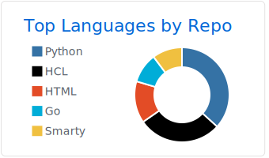
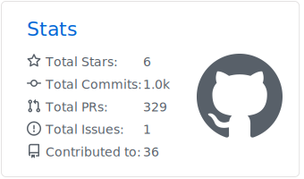

### Hi there, I'm Calvine 👋

<h1> Hello World ! </h1>

## I'm a Developer, and DevOps Engineer!!

- 🌱 I’m currently learning everything 🤣
- 👯 I’m looking to collaborate with other developers
- 🥅 2021 Goals: Contribute more to Open Source projects and get 2 Cloud Certifications
- ⚡ Fun fact: I love listening to rhumba

### Languages & Tools 🛠

&nbsp;
&nbsp;
&nbsp;
&nbsp;
&nbsp;
&nbsp;

&nbsp;
&nbsp;
&nbsp;
&nbsp;
&nbsp;

&nbsp;
&nbsp;
&nbsp;
&nbsp;
&nbsp;
&nbsp;

&nbsp;
&nbsp;
&nbsp;
&nbsp;
&nbsp;

### Analytics ⚙️
  

  
  

  
  

<!-- 

 -->

<!-- 

  
  
  

 -->

<!--  -->
<!--  -->

### Let's connect ? 🤝

