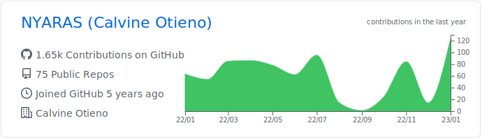

# Software Developer & DevOps Engineer

- 🌱 I’m currently learning everything 🤣
- 👯 I’m looking to collaborate with other developers
- 🥅 2023 Goals: Contribute more to Open Source projects and get at least 3 Cloud Certifications
- ⚡ Fun fact: I love listening to Rhumba and travelling

### Follow me here 🤝

I post frequently on [medium](https://medium.com/@calvineotieno010), and on [linkedin](https://www.linkedin.com/in/calvine-otieno-0259a813b).

### Languages & Tools 🛠

&nbsp;
&nbsp;
&nbsp;
&nbsp;
&nbsp;
&nbsp;

&nbsp;
&nbsp;
&nbsp;
&nbsp;

&nbsp;
&nbsp;
&nbsp;
&nbsp;
&nbsp;
&nbsp;
&nbsp;

&nbsp;
&nbsp;
&nbsp;
&nbsp;
&nbsp;
&nbsp;

### Analytics ⚙️
  

  
  

  
  

### Stories by Calvine Otieno on Medium
 - [Effortlessly Save Your Travel Locations with this iPhone Shortcut](https://medium.com/robotacademy/effortlessly-save-your-travel-locations-with-this-iphone-shortcut-d64127839e3c?source=rss-b1a89a0af139------2)
 - [Organizing Your Downloads Directory with Python](https://medium.com/robotacademy/organizing-your-downloads-directory-with-python-d5b0978b05df?source=rss-b1a89a0af139------2)
 - [Monitor your Mac’s battery life with Python](https://medium.com/robotacademy/monitor-your-macs-battery-life-with-python-8e3b2bb135ab?source=rss-b1a89a0af139------2)
 - [Use OpenAI to Respond to an Email](https://medium.com/robotacademy/use-openai-to-respond-to-an-email-5c1026b642b8?source=rss-b1a89a0af139------2)
 - [5 Tasks To Automate With Python](https://medium.com/robotacademy/5-tasks-to-automate-with-python-e7146996f3?source=rss-b1a89a0af139------2)
 - [Easily Make Youtube Compilations Using Python](https://medium.com/robotacademy/easily-make-youtube-compilations-using-python-6e07ae26a0f4?source=rss-b1a89a0af139------2)
 - [Add  A New Dimension To Your Photos Using Python](https://medium.com/robotacademy/add-a-new-dimension-to-your-photos-using-python-4baf7a0a607a?source=rss-b1a89a0af139------2)
 - [Essential Characteristics That Lead to Elite-Performing Engineering Teams](https://medium.com/leading-and-managing/essential-characteristics-that-lead-to-elite-performing-engineering-teams-176268f483a9?source=rss-b1a89a0af139------2)
 - [How I Accidentally Made $250 In The First Month Building My Personal Brand](https://medium.com/dylanroy/how-i-accidentally-made-250-in-the-first-month-building-my-personal-brand-9ac3f3cf9fc8?source=rss-b1a89a0af139------2)
 - [Deploy To Google Cloud Run Using Github Actions](https://towardsdatascience.com/deploy-to-google-cloud-run-using-github-actions-590ecf957af0?source=rss-b1a89a0af139------2)